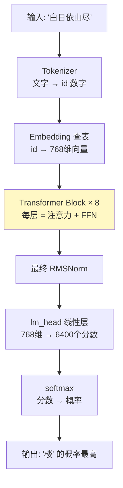
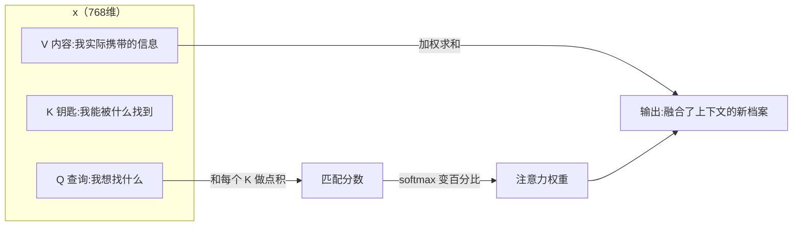
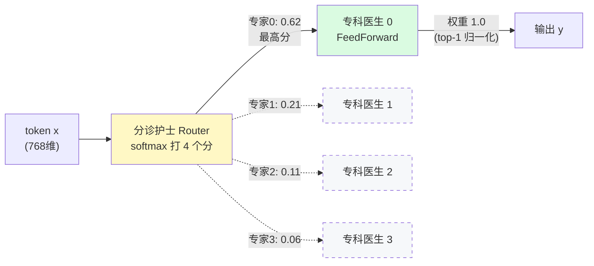

# ② 模型架构 · Transformer 全拆解

> 💡 把大模型想象成一条**流水线工厂**：文字从一端进厂（token 化），经过 8 层相同的车间（Transformer Block）逐层加工提纯，最后出厂时变成"下一个字是什么"的概率表。本章逐个车间参观，最后看"混合专家"这个特殊车间。

## 2.0 整体架构：一个 token 的旅程

先看全景。MiniMind 模型（`model/model_minimind.py`，仅 287 行）整体就这一条流水线：



> 📌 **核心概念正名 · 自回归（Autoregressive）**：模型每次只预测**下一个 token**，然后把预测结果拼回输入再预测下一个——像接龙一样滚动。生成一段话 = 循环执行 N 次接龙。这就是"GPT"里 T（Transformer）前那个 G（Generative）的工作方式。

下面按流水线顺序逐层拆。源码均出自 `model/model_minimind.py`，带行号引用。

## 2.1 Embedding：给每个词发"性格档案"

> 💡 比喻：每个字词是一个人。计算机不认识"猫"字，只认识数字。最笨的办法是发工牌号（id=1024），但工牌号之间没有关系（1024 号和 1025 号毫无联系）。**Embedding 是给每个人写一份 768 项的"性格档案"**：毛茸茸程度、会抓老鼠程度、高冷程度……语义相近的词，档案数值也相近——"猫"和"狗"的档案很像，"猫"和"微积分"差很远。

```python
# model_minimind.py L196
self.embed_tokens = nn.Embedding(config.vocab_size, config.hidden_size)
# 一张 6400 行 × 768 列的大表：词表里每个 token 占一行档案
# forward 时（L226）就是"查表"：拿到 token id，取出对应的那一行
hidden_states = self.dropout(self.embed_tokens(input_ids))
```

> 📌 **核心概念正名 · 张量（Tensor）**：就是多维表格。`[batch, seq_len, 768]` 读作"一批句子 × 每句 N 个 token × 每个 token 一个 768 维档案"。后面所有代码里的张量形状，都请用"几维表格"去读。

一个技巧：MiniMind 的**输入 embedding 表和输出层共用同一张表**（`tie_word_embeddings=True`，L240）——"理解一个词"和"说出一个词"用同一份档案，省一半参数。

## 2.2 RMSNorm：进车间前先"整理仪容"

> 💡 比喻：数据在车间之间传送时，数值会渐渐"飘"（有的维度变得巨大、有的趋近零，像衣服皱了）。RMSNorm 就是每个车间门口的整理仪容镜：把每个人（token 向量）按统一标准"抚平"，防止数值越来越离谱导致训练崩溃。

```python
# model_minimind.py L50-59
class RMSNorm(torch.nn.Module):
    def norm(self, x):
        # x.pow(2).mean(-1)：每个人 768 项数值的"平均波动量"
        # torch.rsqrt(...)：波动越大，除得越狠 → 压回标准幅度
        return x * torch.rsqrt(x.pow(2).mean(-1, keepdim=True) + self.eps)
    def forward(self, x):
        # 先升到 float32 算（更稳），再转回原精度；weight 是可学的"每项重要度"
        return (self.weight * self.norm(x.float())).type_as(x)
```

> 📌 **核心概念正名 · Pre-Norm**：MiniMind 用"进车间门前整理"（Pre-Norm：先 Norm 再进注意力/FFN），这是现代 LLM 标配（GPT-2 时代是 Post-Norm）。好处：深网络梯度流动更稳，训练不容易崩。

## 2.3 Attention：开会时决定"听谁说话"

这是 Transformer 的灵魂，也是最长的一节。

> 💡 比喻：你在会议里发言（生成当前 token），会先扫一眼在场所有人（前文所有 token），决定**该重点听谁的**。"白日依山尽，欲穷千里__"——要填"楼"，你会重点注意"千里"（要登高）和"依山"（有山才有楼）。Attention 就是把这个"分配注意力"的过程变成可计算的乘法。



三步人话版：
1. **每个 token 发出 Q（query 查询）**："我需要什么样的信息？"
2. **Q 和所有人的 K（key 钥匙）做匹配打分** → softmax 变成百分比（总和 100%）
3. **按百分比把所有人的 V（value 内容）加权混合** → 得到融合了上下文的新表示

> 📌 **核心概念正名 · softmax**：把一串任意分数变成"总和为 1 的百分比"的函数。分数高的占比大，且用指数放大差距——80 分和 60 分的占比远不止 80:60。Attention 用它决定"注意力预算怎么分"。
>
> **核心概念正名 · GQA（分组查询注意力）**：MiniMind 用 8 个 Q 头但只配 4 个 K/V 头（`num_key_value_heads=4`），2 个 Q 头共享 1 组 KV。比喻：8 位发言人（Q 头）共用 4 位速记员（KV 头）——速记量减半，效果几乎不掉。这是现代 LLM 省 KV cache 显存的标准操作（Llama3/Qwen3 同款）。代码里 `repeat_kv`（L86）就是把 4 份速记复制成 8 份供各头使用。

核心代码（`Attention.forward`，L112-134）逐块：

```python
xq, xk, xv = self.q_proj(x), self.k_proj(x), self.v_proj(x)
# ① 三把投影：用同一个 x 算出 Q/K/V 三份档案（768维 → 拆成 8 头 × 96 维）

xq = xq.view(bsz, seq_len, self.n_local_heads, self.head_dim)
# ② 拆头：768 维档案切成 8 份，每头独立看一个侧面（类似 8 个视角的评审员）

xq, xk = self.q_norm(xq), self.k_norm(xk)
# ③ QK-Norm：Q/K 各自先 RMSNorm（Qwen3 同款）——小模型训练稳定的关键

xq, xk = apply_rotary_pos_emb(xq, xk, cos, sin)
# ④ RoPE 旋转位置编码（见 2.4）

if self.flash and ...:
    output = F.scaled_dot_product_attention(xq, xk, xv, is_causal=self.is_causal)
# ⑤ 官方融合算子一步算完注意力（快）；否则手写：scores = Q@K/sqrt(d) → softmax → @V
# is_causal=True：因果掩码——接龙只许看前文，不许偷看答案（未来 token）
```

> 📌 **核心概念正名 · 因果掩码（Causal Mask）**：生成第 5 个字时不许看第 6 个字——矩阵上三角置 -inf，softmax 后权重为 0。"接龙游戏不许翻答案页"的代码化。

## 2.4 RoPE：给座位编号的"旋转魔法"

> 💡 比喻：Attention 本身不知道词的**先后顺序**（"猫咬狗"和"狗咬猫"在它眼里一样）。RoPE（旋转位置编码）给每个位置的 Q/K 向量按位置角度**旋转**：位置 0 转 0°，位置 1 转 θ°，位置 2 转 2θ°……两个位置做点积时，角度差自然编码了"相距多远"——像钟表指针，看夹角就知道差了几小时。

```python
# model_minimind.py L62-78（预计算 cos/sin 表）+ L80-84（套用到 q/k）
freqs = 1.0 / (rope_base ** (torch.arange(0, dim, 2)[:dim//2].float() / dim))
# 每个维度转不同速度：低维转得慢（编码远距离），高维转得快（编码近距离）——多位钟表
# YaRN（L64-73）：推理超长文本时把"转速"缩放，32768 位置外推的技巧，此处不展开
```

> 📌 **核心概念正名 · RoPE（Rotary Position Embedding）**：把位置信息注入 Q/K 的旋转式编码，现代 LLM 统一标配。知道三件事即可：①让 Attention 感知词序；②支持长文本外推（YaRN）；③只旋 Q/K，不旋 V。

## 2.5 FFN（SwiGLU）：消化知识的"胃"

> 💡 比喻：Attention 负责"收集各方情报"（谁说了什么），FFN 负责"消化成自己的知识"。它把 768 维**先扩到 2432 维**（比喻：把情报摊开在大桌子上细看），加工后再压回 768 维。两层之间模型存储了绝大部分"世界知识"。

```python
# model_minimind.py L136-146
class FeedForward(nn.Module):
    def forward(self, x):
        # gate_proj 和 up_proj 并行把 768→2432 维，down_proj 压回 768
        return self.down_proj(self.act_fn(self.gate_proj(x)) * self.up_proj(x))
        # SwiGLU：silu(gate(x)) * up(x) —— "门控"：gate 分支决定 up 分支哪些信息放行
```

> 📌 **核心概念正名 · SwiGLU**：带门控的前馈网络 = `silu(gate(x)) ⊙ up(x)`。⊙ 是逐元素相乘，silu 是平滑版 ReLU。门控让网络能"选择性放行"信息，比普通两层 MLP 效果更好，代价是多一个矩阵（现代 LLM 全用它）。

## 2.6 MoE 混合专家：医院分诊台 ⭐

前面所有车间每个 token 都全员参与。**MoE 把 FFN 车间改造成"分诊医院"**——这是本站重点概念。

> 💡 比喻：普通 FFN 是一个"全科医生"给所有病人看所有病。MoE 医院：进门先见**分诊护士（router/gate）**，她快速判断你的症状该挂哪个科，把病人（token）分给最对口的**专科医生（expert）**。MiniMind 配置：4 个专科医生，每次只看 1 个（top-1）。医院总人力是全科的好几倍（总参数 198M），但每个病人只占用 1 个医生的时间（激活参数 64M）——**容量大、算力省**，这就是 MoE 的全部野心。



核心代码逐块（`MOEFeedForward.forward`，L154-176）：

```python
# ① 分诊：gate 是个 768→4 的线性层，softmax 后是 4 个"挂号概率"
scores = F.softmax(self.gate(x_flat), dim=-1)              # [token数, 4]
topk_weight, topk_idx = torch.topk(scores, k=1, dim=-1)    # ② 只选最高分的 1 科 (top-1)
topk_weight = topk_weight / (topk_weight.sum(-1, keepdim=True) + 1e-20)
# ③ 权重归一化：top-1 时恒等于 1.0（给 top-k>1 用的，保证输出幅度稳定）

# ④ 分发执行：每个专家只领走"选中自己"的那批 token（稀疏计算！）
y = torch.zeros_like(x_flat)
for i, expert in enumerate(self.experts):          # 4 个专家循环
    mask = (topk_idx == i)                         # 哪些 token 选了专家 i
    if mask.any():
        token_idx = mask.any(-1).nonzero().flatten()
        weight = topk_weight[mask].view(-1, 1)
        y.index_add_(0, token_idx, expert(x_flat[token_idx]) * weight)
        # 只有被选中的 token 才过专家 i 的 FFN —— "总参 198M / 激活 64M" 的实现机制

# ⑤ 负载均衡辅助损失：防止所有病人全挂同一个科
load = F.one_hot(topk_idx, 4).float().mean(0)      # 实际挂号频率
self.aux_loss = (load * scores.mean(0)).sum() * 4 * coef
# 频率 × 概率 的乘积和：专家越"又红又专"（被选多且自评分高），罚越重
```

> ⚠️ **两个容易忽略的工程细节**（源码里的巧思）：
> 1. **`elif self.training` 分支**（L170）：某专家这批一个 token 都没分到时，也要凑一个 `0 * sum(p)` 的梯度挂钩——否则 DDP 多卡训练时各卡参数不同步会死锁
> 2. **aux_loss 只在训练时算**，推理零开销；它通过 `MiniMindModel.forward` 把 8 层的 aux_loss 全加起来，由训练脚本挂进总损失（`loss = res.loss + res.aux_loss`）

> 📌 **核心概念正名 · 负载均衡辅助损失（aux_loss）**：公式 `N · Σ(load_i × score_i)`。两个因子：load（专家被选的实际频率，不可导）× score（router 给的概率，可导）——乘积让"被高频选中"的专家的概率项受到更强压制，等效于用可导的 score 去影响不可导的选择。**理论边界：完全均衡时 aux=1（下界，与专家数无关），全部挤一个专家时 aux=N**。训练目标是把 aux_loss 压向 1 附近。

> 🔬 **实战验证（我的 M0 数值实验，本地 CPU 复现）**
> - 场景实测：均衡负载 aux=**1.000** ✓ · 70% 偏斜 aux=2.09 · 完全崩塌 aux=**4.000** ✓（公式边界精确吻合）
> - 崩塌修复实验：人为把专家 0 的 gate 抬高（负载 48.8%），只训 router 用纯 aux_loss 优化——**150 步内负载回到完美 25/25/25/25**
> - 这解释了为什么 aux_loss 系数很小（5e-4）也有用：它的任务只是"轻轻扶正"，能力学习仍由主 loss 主导
>
> 待续：M3（Kaggle MoE 短跑）将观察真实训练中专家是否自发分工（不同类型文本偏好不同专家）。

## 2.7 生成采样：接龙怎么"选字"

模型输出的是 6400 个 token 的概率表，怎么选下一个字？

> 💡 比喻：temperature 是"冒险程度"——低温=保守派总选概率最高的字（输出呆板但稳），高温=冒险派愿意赌小概率字（输出多样但易胡说）。top-p（nucleus）是"只在累计概率前 85% 的候选里抽签"，砍掉长尾怪字。

```python
# model_minimind.py generate()，L266-278
logits = outputs.logits[:, -1, :] / temperature   # ① 温度：除以 T<1 拉大差距(保守)，T>1 缩小(冒险)
logits[logits < torch.topk(logits, 50)[0][..., -1, None]] = -float('inf')  # ② top-k: 只留前 50 名
# ③ top-p: 累计概率超 85% 之后的候选全部 -inf（代码 L269-273）
next_token = torch.multinomial(torch.softmax(logits, -1), 1)  # ④ 按概率抽签
```

> 📌 **核心概念正名 · KV Cache**：生成第 N 个字时，前 N-1 个字的 K/V 速记不用重算——存起来直接复用（`past_key_values`）。生成从 O(N²) 降到 O(N)，这就是推理时"越聊越快但显存越占越多"的原因。

## 收束：一个 token 的完整旅程

"欲穷千里__"：token 化 → embedding 查档案 → 过 8 层车间（每层：RMSNorm 整装 → Attention 看前文 → RMSNorm → FFN/MoE 消化）→ 最终 Norm → lm_head 打 6400 个分 → softmax → 按 temperature/top-p 抽签 → "**楼**"。

> ✅ **自测 3 问（用术语作答）**
> 1. Attention 的 Q/K/V 各自对应比喻里的什么？因果掩码解决什么问题？
> 2. GQA 为什么能用 8 个 Q 头只配 4 个 KV 头？省的是什么？
> 3. MoE 的 aux_loss 为什么用 load×score 乘积而不是只惩罚 load？（提示：梯度要能传回 router）
