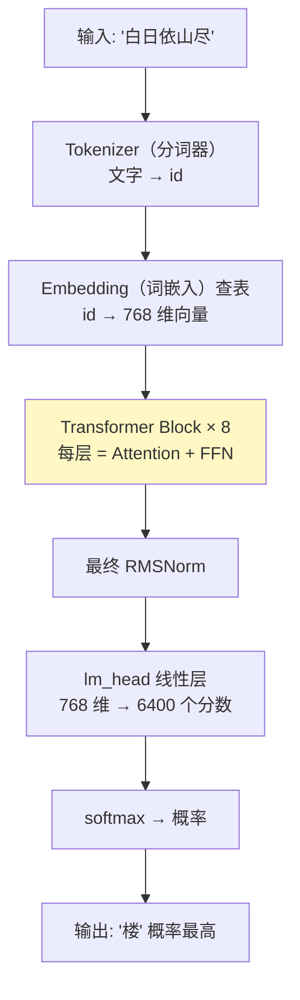
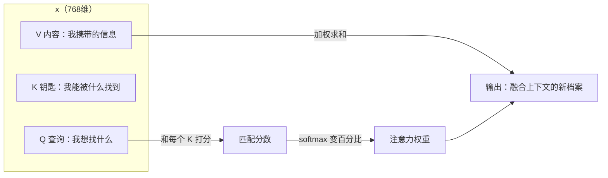
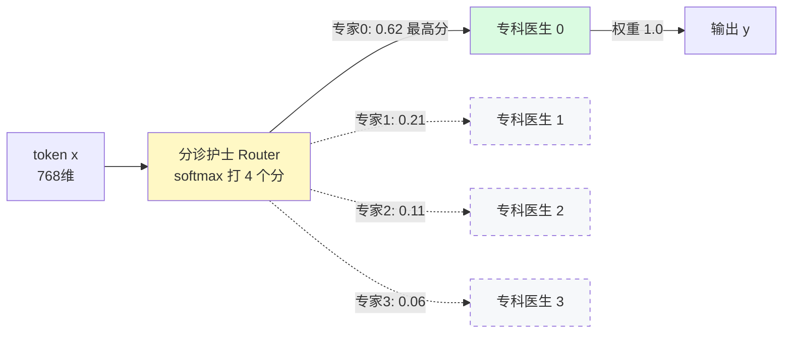

# ② 模型架构 · Transformer（变换器）全拆解

> 💡 模型是一条**流水线**：文字进厂 → 8 个相同车间逐层加工 → 出厂变成"下一个字的概率表"。本章逐车间参观。末尾是"混合专家"特殊车间。

## 2.0 整体架构：一个 token（词元）的旅程

MiniMind 模型 = `model/model_minimind.py`，287 行。全景：



> 📌 **Autoregressive（自回归）**：每次只预测下一个 token。预测结果拼回输入，再预测下一个。生成一段话 = 循环接龙 N 次。

## 2.1 Embedding（词嵌入）：每个词一份档案

> 💡 计算机不认识"猫"，只认数字。最笨方案：发编号。编号之间无关系——1024 号和 1025 号毫无联系。
> Embedding 给每个 token 一份 768 维**数值档案**：语义近的词，档案也近。"猫"和"狗"像，"猫"和"微积分"差远。

```python
# model_minimind.py L196
self.embed_tokens = nn.Embedding(config.vocab_size, config.hidden_size)
# 一张 6400 行 × 768 列的表：每个 token 一行档案
# forward 时查表（L226）：拿到 id，取出对应行
hidden_states = self.dropout(self.embed_tokens(input_ids))
```

> 📌 **Tensor（张量）**：多维表格。`[batch, seq_len, 768]` = 一批句子 × 每句 N 个 token × 每个一份 768 维档案。后续所有形状都这么读。

技巧：输入 embedding 表和输出层**共用一张表**（`tie_word_embeddings=True`，L240）。理解和输出用同一份档案，省一半参数。

## 2.2 RMSNorm（均方根归一化）：车间门口的稳定器

> 💡 数据在车间间传送会"飘"：有的维度巨大，有的趋零。数值越飘越远，训练会崩。
> RMSNorm 在每个车间门口把数值压回标准幅度。

```python
# model_minimind.py L50-59
class RMSNorm(torch.nn.Module):
    def norm(self, x):
        # 均值波动量越大，除得越狠 → 压回标准幅度
        return x * torch.rsqrt(x.pow(2).mean(-1, keepdim=True) + self.eps)
    def forward(self, x):
        # 升 float32 算（更稳）再转回；weight 是可学的"各项重要度"
        return (self.weight * self.norm(x.float())).type_as(x)
```

> 📌 **Pre-Norm（前置归一化）**：先 Norm 再进 Attention/FFN。现代 LLM 标配（GPT-2 是后置）。好处：深网络梯度流动稳。

## 2.3 Attention（注意力机制）：决定听谁说话

> 💡 会议上发言前，你先扫一圈在场的人，决定**重点听谁**。
> "白日依山尽，欲穷千里__"——填"楼"要看"千里"（登高）和"依山"（有山）。Attention 把"分配注意力"变成乘法。



三步：
1. token 发出 Q（查询）："我需要什么信息？"
2. Q 与所有人的 K（钥匙）打分 → softmax 成百分比
3. 按百分比混合所有人的 V（内容）→ 新表示

> 📌 **softmax（归一化指数函数）**：任意分数 → 总和为 1 的概率。指数放大差距：80 分和 60 分的占比远超 80:60。
>
> 📌 **GQA（分组查询注意力）**：8 个 Q 头共享 4 组 KV。比喻：8 位发言人共用 4 位速记员——速记量减半，效果几乎不掉。Llama3/Qwen3 同款。`repeat_kv`（L86）把 4 份速记复制给 8 头用。

核心代码（`Attention.forward`，L112-134）：

```python
xq, xk, xv = self.q_proj(x), self.k_proj(x), self.v_proj(x)
# ① 同一个 x 算出 Q/K/V（768 维 → 8 头 × 96 维）

xq = xq.view(bsz, seq_len, self.n_local_heads, self.head_dim)
# ② 拆头：768 维切 8 份，每头看一个侧面

xq, xk = self.q_norm(xq), self.k_norm(xk)
# ③ QK-Norm：Q/K 各自先归一化（Qwen3 同款，小模型稳定关键）

xq, xk = apply_rotary_pos_emb(xq, xk, cos, sin)
# ④ RoPE 旋转位置（见 2.4）

output = F.scaled_dot_product_attention(xq, xk, xv, is_causal=self.is_causal)
# ⑤ 一步算完注意力；手写版：Q@K/sqrt(d) → softmax → @V
```

> 📌 **Causal Mask（因果掩码）**：未来位置分数置 -inf → softmax 后权重 0。生成第 5 个字不许看第 6 个字。"接龙不许翻答案页"的代码化。

## 2.4 RoPE（旋转位置编码）：座位编号的旋转魔法

> 💡 Attention 本身不知词序——"猫咬狗"和"狗咬猫"它看一样。
> RoPE 按位置**旋转** Q/K：位置 0 转 0°，位置 1 转 θ°……点积时角度差自动编码距离。钟表指针：看夹角，知差几小时。

```python
# model_minimind.py L62-78 预计算 cos/sin 表；L80-84 套用到 q/k
freqs = 1.0 / (rope_base ** (torch.arange(0, dim, 2)[:dim//2].float() / dim))
# 每维不同转速：低维慢（编码远距），高维快（编码近距）——多针钟表
# YaRN（L64-73）：长文外推时缩放转速，32768 位置的来源
```

> 📌 三件事记住 RoPE：①让 Attention 感知词序 ②只旋 Q/K 不旋 V ③YaRN 支持长文外推。

## 2.5 FFN（前馈网络）+ SwiGLU（门控激活）

> 💡 Attention 收集上下文信息。FFN 加工并存储知识——模型大部分"世界知识"在这层的参数里。
> 768 维先扩到 2432 维细看，再压回 768 维。

```python
# model_minimind.py L136-146
def forward(self, x):
    return self.down_proj(self.act_fn(self.gate_proj(x)) * self.up_proj(x))
    # silu(gate(x)) ⊙ up(x)：gate 分支决定 up 分支哪些信息放行
```

> 📌 **SwiGLU**：`silu(gate(x)) ⊙ up(x)`。⊙ = 逐元素乘。门控选择性放行，比普通两层 MLP 强，代价是三个矩阵。

## 2.6 MoE（混合专家）：医院分诊台 ⭐

前面车间每个 token 全员参与。MoE 把 FFN 车间改成**分诊医院**。

> 💡 分诊护士（router）按症状把病人（token）分给专科医生（expert）。
> MiniMind：4 个专科医生，每次只看 1 个（top-1）。
> 医院总人力 198M，每个病人只占 1 个医生的 64M 时间——**容量大、算力省**。



核心代码（`MOEFeedForward.forward`，L154-176）：

```python
# ① 分诊：gate 是 768→4 线性层，softmax 后 4 个"挂号概率"
scores = F.softmax(self.gate(x_flat), dim=-1)              # [token数, 4]
topk_weight, topk_idx = torch.topk(scores, k=1, dim=-1)    # ② 选最高分 1 科（top-1）
topk_weight = topk_weight / (topk_weight.sum(-1, keepdim=True) + 1e-20)
# ③ 归一化：top-1 时恒等于 1.0（top-k>1 时才生效）

# ④ 分发：每个专家只领走选中自己的 token（稀疏计算）
y = torch.zeros_like(x_flat)
for i, expert in enumerate(self.experts):
    mask = (topk_idx == i)
    if mask.any():
        token_idx = mask.any(-1).nonzero().flatten()
        y.index_add_(0, token_idx, expert(x_flat[token_idx]) * topk_weight[mask].view(-1, 1))
        # 只有被选中的 token 过专家 i → "总参 198M / 激活 64M" 的实现

# ⑤ 负载均衡：防止病人全挂一个科
load = F.one_hot(topk_idx, 4).float().mean(0)      # 实际挂号频率
self.aux_loss = (load * scores.mean(0)).sum() * 4 * coef
# 频率×概率 乘积和：越"又红又专"罚越重
```

> ⚠️ **两个工程细节**（源码巧思）：
> 1. `elif self.training` 分支（L170）：某专家这批没分到 token，也要凑 `0 * sum(p)` 梯度挂钩——否则 DDP 多卡参数不同步，死锁
> 2. aux_loss 只在训练算，推理零开销；8 层的 aux_loss 相加后挂进总损失

> 📌 **aux_loss（负载均衡辅助损失）**：`N · Σ(load_i × score_i)`。load=实际频率（不可导），score=router 概率（可导）。乘积让"被高频选中"的专家概率项受更强压制。**边界：均衡=1（下界，与 N 无关），全挤一个=N（上界）**。目标：压向 1。

> 🔬 **实战验证（M0 数值实验，本地 CPU）**
> - 均衡负载 aux=**1.000** ✓ · 70% 偏斜 aux=2.09 · 完全崩塌 aux=**4.000** ✓
> - 崩塌修复：专家 0 垄断 48.8%，只训 router 用 aux_loss——**150 步回到 25/25/25/25**
> - 系数 5e-4 很小也有用：任务只是"轻轻扶正"，能力学习由主 loss 主导
>
> 待续：M3（Kaggle MoE 短跑）观察专家是否自发分工。

<a class="btn-play" href="/playground/moe-router.html">🎮 在线玩一把：MoE 路由模拟器</a>

<p style="color:var(--muted);font-size:14px">拨动 4 个专家的偏好滑块，实时看 token 分流、负载条和 aux_loss。亲手制造"专家崩塌"再拉回。</p>

## 2.7 采样：接龙怎么选字

模型输出 6400 个概率。怎么选下一个字？

> 💡 temperature（温度）= 冒险度：低温选最高分（呆板稳），高温赌小概率（多样易胡说）。
> top-p（核采样）= 只在累计概率前 85% 里抽签，砍掉长尾。

```python
# model_minimind.py generate() L266-278
logits = outputs.logits[:, -1, :] / temperature   # ① T<1 拉大差距，T>1 缩小
logits[logits < torch.topk(logits, 50)[0][..., -1, None]] = -float('inf')  # ② top-k 留前 50
# ③ top-p：累计 85% 后的候选全 -inf（L269-273）
next_token = torch.multinomial(torch.softmax(logits, -1), 1)  # ④ 按概率抽签
```

> 📌 **KV Cache（键值缓存）**：生成第 N 字时，前 N-1 字的 K/V 不重算——存起来复用（`past_key_values`）。复杂度 O(N²) → O(N)。代价：越聊显存越占。

## 收束：一个 token 的完整旅程

"欲穷千里__"：token 化 → embedding 查档案 → 8 层车间（RMSNorm → Attention → RMSNorm → FFN/MoE）→ 最终 Norm → lm_head 打 6400 分 → softmax → 按 temperature/top-p 抽签 → "**楼**"。

> ✅ **自测 3 问（用术语作答）**
> 1. Q/K/V 各是什么？因果掩码解决什么？
> 2. GQA 为何 8 个 Q 头只配 4 组 KV？省什么？
> 3. aux_loss 为何用 load×score 乘积，不单罚 load？（提示：梯度回传）

<details><summary>参考答案（先自己答完再展开）</summary>

1. **Q=查询**（我想找什么）、**K=钥匙**（被什么匹配）、**V=内容**（实际信息）。Q 与所有 K 打分 → softmax → 加权混合 V。**因果掩码**把未来 token 分数置 -inf，自回归只能看前文。
2. 多个 Q 头共享一组 KV（2Q:1KV）。省 **KV cache 显存与计算**：K/V 数量减半，效果几乎不掉。
3. **load 不可导**（topk 离散选择，梯度断路），**score 可导**。乘积把"高频被选"专家的 score 梯度放大，用可导的 score 拉动不可导的 load 走向均衡。单罚 load 无梯度回传。

</details>
