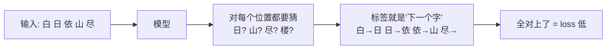

# ④ 训练范式 · Pretrain（文字接龙魔鬼训练营）

> 💡 Pretrain 只做一件事：**遮住句尾，猜下一个字**。猜错就调整 6400 万个参数。
> 把 127 万句猜完一遍，语言规律就进了参数。这个简单任务是一切能力的地基。

## 4.1 训练目标：Next Token Prediction



关键认知：**训练时每个位置都在同时学习**，不是只学最后一个字。"白→日"教它语法，"依山尽→楼"教它知识，"尽→句号"教它停顿。一句话 340 个 token 就是 340 道练习题。

> 📌 **核心概念正名 · 交叉熵损失（Cross-Entropy Loss）**：衡量"模型的概率分布"与"正确答案"的距离。直觉版：**loss = 模型对正确答案的"惊讶程度"**。模型给正确字分配的概率越高，越不惊讶，loss 越低：
> - 随机初始化 + 6400 词表：每个字概率 ≈ 1/6400，loss = -ln(1/6400) = **ln(6400) ≈ 8.76**（理论起点）
> - 我实测 K2 首个记录点 loss = 7.58（词表内频率不均，低于理论上界）✓
> - 训完 loss = 2.02：相当于"正确字给到约 13% 概率"（e^-2.02 ≈ 0.13）——在 6400 选 1 里这已是碾压性准确

## 4.2 数据是怎么喂的：PretrainDataset 逐块讲

源码 `dataset/lm_dataset.py L37-55`：

```python
def __getitem__(self, index):
    sample = self.samples[index]
    # ① 文本 → token id 序列，最长 340-2（给 bos/eos 留位）
    tokens = self.tokenizer(str(sample['text']), add_special_tokens=False,
                            max_length=self.max_length - 2, truncation=True).input_ids
    # ② 首尾加特殊标记：<bos>(开头哨兵) + 正文 + <eos>(结尾哨兵)
    #    模型由此学会"何时该闭嘴"——生成出 <eos> 就停止
    tokens = [self.tokenizer.bos_token_id] + tokens + [self.tokenizer.eos_token_id]
    # ③ 不足 340 的补 <pad> 填满（把不同长度句子装进同一个方矩阵）
    input_ids = tokens + [self.tokenizer.pad_token_id] * (self.max_length - len(tokens))
    input_ids = torch.tensor(input_ids, dtype=torch.long)
    # ④ 标签 = 输入的拷贝，但 pad 位置改成 -100
    labels = input_ids.clone()
    labels[input_ids == self.tokenizer.pad_token_id] = -100
    return input_ids, labels
```

> 📌 **核心概念正名 · ignore_index=-100**：CrossEntropy 的约定——标签为 -100 的位置**不参与 loss**（填空题里空着不算分）。Pretrain 阶段只有 pad 不算分；SFT 阶段将用同一机制实现"只学 assistant 的话"（见 4.6）。

> 📌 **核心概念正名 · shift（错位对齐）**：模型内部 `logits[..., :-1]` 与 `labels[..., 1:]` 对齐（`model_minimind.py L245`）——用第 1~N-1 个位置去预测第 2~N 个字。"接龙"在张量上就是错开一格。

## 4.3 训练循环：每一步发生什么

源码 `trainer/train_pretrain.py train_epoch` 逐块（省略日志）：

```python
lr = get_lr(epoch * iters + step, args.epochs * iters, args.learning_rate)
for param_group in optimizer.param_groups: param_group['lr'] = lr
# ① 学习率调度：手写余弦 0.55×lr → 0.1×lr（train_pretrain.py 的 get_lr）

with autocast_ctx:
    res = model(input_ids, labels=labels)      # ② 前向：算出 340 道题的平均 loss
    loss = res.loss + res.aux_loss             #    MoE 时加上负载均衡损失（dense 时恒 0）
    loss = loss / args.accumulation_steps      # ③ 梯度累积：loss 除以 8

scaler.scale(loss).backward()                  # ④ 反向：算 6400 万个数字各自该怎么调

if step % args.accumulation_steps == 0:
    scaler.unscale_(optimizer)                 # ⑤ 先把放大过的梯度缩回来
    torch.nn.utils.clip_grad_norm_(model.parameters(), args.grad_clip)  # ⑥ 梯度裁剪
    scaler.step(optimizer)                     # ⑦ 真正更新参数
    scaler.update()
    optimizer.zero_grad(set_to_none=True)      # ⑧ 清空梯度，进入下一步
```

> 💡 **Gradient Accumulation（梯度累积）**：batch（批次）32 太小，直接开 256 显存不够。
> 对策：连跑 8 次 batch=32，梯度**只加不更新**，第 8 次才一起更新。
> 数学上等价 batch=256，显存只付 32 的代价。
>
> **比喻 · 梯度裁剪**：某批数据让梯度爆冲（范数突然巨大），裁剪把梯度向量"长度"按比例缩短到上限内——高速路上限速，防一个急弯翻车。
>
> **fp16（半精度）+ GradScaler（梯度缩放器）**：fp16 省一半显存、T4 上更快。代价：小梯度在 fp16 下会下溢变 0。
> GradScaler 对策：**先给 loss 乘大数放大梯度 → 更新前再除回来**。
> 示例：梯度 0.0001 在 fp16 里丢失；先 ×1024 变成 0.1024（fp16 存得住），更新时再 ÷1024 还原。

## 4.4 一次真实训练的全貌（我的 K2 配置）

| 项 | 值 | 含义 |
|---|---|---|
| 模型 | 768×8 dense，63.9M 参数 | minimind-3 主线 |
| 数据 | pretrain_t2t_mini，1.24GB / **1,270,238 行** | mini 子集 |
| batch | 32 × 累积 8 = 等效 256 | max_seq_len 340 |
| 总步数 | 1,270,238 ÷ 32 = **39,695 步** | 1 epoch |
| 硬件 | Kaggle T4 16GB，fp16 | 免费 GPU |
| 耗时 | **4.9 小时** | ~9.1 秒/步 |

## 4.5 实战：loss 曲线与生成眼检


> 🔬 **实战验证（K2 真实数据）**
> - loss：**7.58 → 2.02**（794 个记录点）。前 ~7.5k 步从 7.6 陡降到 2.5（学会高频词和语法骨架），之后 3 万步缓慢磨到 2.0（知识细节）——LLM pretrain 的标准"陡降+长尾"形态
> - aux_loss 恒 0 ✓（dense 模型，验证 M0 推导）
> - 生成眼检（temperature=0.85）：
>   - `"中国的首都是" → "北京。"` —— **1 epoch 就注入了事实知识**
>   - `"人工智能是" → "人工智能人工智能人工智能…"` —— 复读循环
>   - 判读：pretrain 模型会接龙但**没有对话能力**，且采样时容易陷入重复吸引子。这不是 bug，是阶段特征——SFT 是它的药

## 4.6 后续小节（训练完成后滚动更新）

- **SFT：从背书到会聊天** —— 同一套训练循环，只换数据与 loss mask（只学 assistant 段）→ K3 完成后续写
- **LoRA：冻结主体，只训小挂件** —— M4/本地实验后续写
- **蒸馏：让小模型抄大模型的"概率分布"** —— K9 完成后续写

> ✅ **自测 3 问（用术语作答）**
> 1. 为什么随机初始化的模型 loss 理论上是 ln(6400)≈8.76？我实测首个点是 7.58，为什么比理论低？（提示：词频分布）
> 2. batch_size=32 且 accumulation_steps=8 时，为什么 optimizer.step() 每 8 个 batch 才执行一次？等效 batch 是多少？
> 3. GradScaler 在 fp16 训练里解决什么问题？它"先放大后缩小"各发生在哪个时机？
