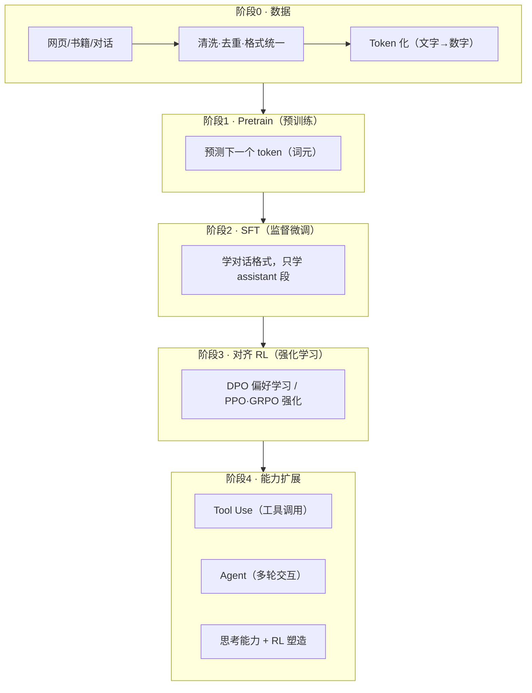
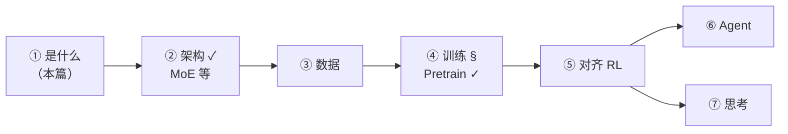

# 全景 · 大模型学习地图

> 📌 **大模型（LLM，Large Language Model）**：读入一段文字、逐字生成下文的神经网络程序。
> 示例：输入 `白日依山尽，欲穷千里` → 输出 `楼`。
> 训练就是让它把这件事做几十亿次，越做越准。

## 一个大模型怎么炼成

结论先行：**大模型 = 海量数据喂出来的"文字接龙"程序**。接龙练到极致，就是智能。

各阶段一句话：

| 阶段 | 干什么 | 示例 |
|---|---|---|
| 数据 | 清洗、去重、格式化语料 | 剔除乱码页，保留成段文章 |
| Pretrain | 预测下一个 token | `白日依山` → 学会接 `尽` |
| SFT | 学对话格式，只学回答段 | 问"你好"→ 学会答"你好！有什么帮你" |
| DPO/PPO/GRPO | 好答案加分，坏答案减分 | 同一问题两版回答，学选好的 |
| Tool Use | 生成工具调用指令 | "现在几点"→ 输出 `get_current_time()` |
| Agent | 多轮交互完成整任务 | 查天气→调工具→读结果→回答 |
| 思考 | 答前先出推理草稿 | 先写 `<think>列式计算…</think>` 再答 |

## MiniMind 是什么

[MiniMind](https://github.com/jingyaogong/minimind)：**4647 行**的迷你 GPT。

| 特性 | 说明 |
|---|---|
| 小而全 | Qwen3 同款架构，每行都读得完 |
| 算法裸写 | 无框架封装，loss/GAE/KL 全是裸 PyTorch |
| 单卡可训 | 64M 参数，Kaggle 免费 T4 五小时出会聊天的模型 |

> 📌 **参数（Parameter）**：模型里可被训练调整的数字。768×8 配置 ≈ **6400 万个**。GPT-3 是它的 2700 倍。64M 是"单卡能训"与"有实际能力"的平衡点。

## 学习路径与进度

进度绑定 Kaggle 训练流水线：每完成一个实验（K2 pretrain → K3 SFT → …），产出对应章节。**"实战验证"栏目全是真实训练数据**。

## 怎么用

| 用法 | 做法 |
|---|---|
| 系统学 | 按侧栏顺序。节奏固定：比喻→图→概念→代码→实战→自测 |
| 翻阅查 | 按侧栏标题直击，如"MoE 路由"→ 第②篇 |
| 自测 | 每章 3 问。不看笔记、用术语答出才算过 |

> ✅ **自测 3 问**
> 1. 训练四阶段各解决什么问题？
> 2. Pretrain 的训练任务是什么？为什么简单任务能产生智能？
> 3. 64M 参数什么量级？为什么这么小？

参考答案

1. 数据：干净语料。Pretrain：语言底座。SFT：对话格式。RL：偏好与能力对齐。
2. Next Token Prediction（下一个词元预测）。猜下一个字要求懂语法、事实、推理——能力是压缩海量数据的副产品。
3. 6400 万可调数字。单卡（16GB）放得下，几小时训完，能力足够演示全部概念。

