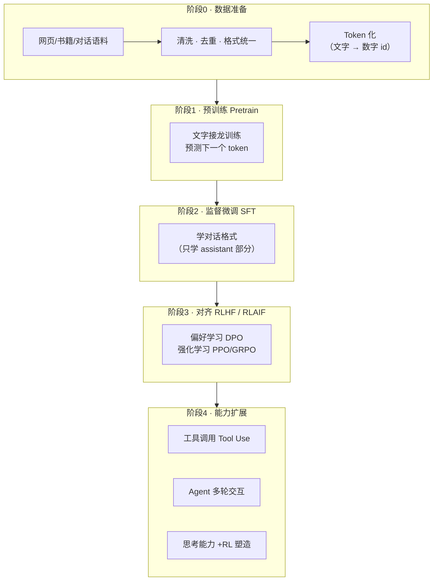
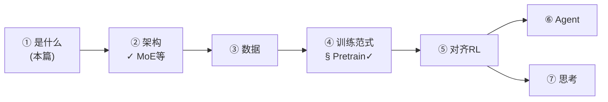

# 全景 · 大模型学习地图

> 💡 把大模型想象成一座**主题乐园**：数据是食材供应链，预训练是教厨师基础刀工，SFT 是教他按菜单做菜，RLHF/RLAIF 是顾客点评驱动米其林冲刺，Tool Use 是给他配齐厨房设备，思考能力是"先想菜谱再动手"的习惯。本站逐个车间参观。

## 一个大模型是怎么炼成的

先给结论：**大模型 = 一个超大规模的"文字接龙"程序，通过海量数据 + 多阶段训练，把接龙练成了智能**。

每个阶段一句话人话版：

| 阶段 | 人话 | 比喻 |
|---|---|---|
| 数据准备 | 把乱七八糟的文本洗成干净语料 | 菜洗净切好才能下锅 |
| Pretrain | 疯狂玩"预测下一个字"游戏 | 背下半个图书馆，练出语感 |
| SFT | 看正确对话示范，学会一问一答 | 从背书到会聊天 |
| DPO/PPO/GRPO | 从好坏答案对比中学会"讨人喜欢" | 顾客点评驱动的服务改进 |
| Tool Use | 学会喊工具帮忙算数查天气 | 厨师学会用烤箱 |
| Agent RL | 多轮试错中学会完成完整任务 | 实习生在真实厨房摸爬滚打 |
| 思考 | 先写草稿再给答案 | 想好菜谱再开火 |

## MiniMind 是什么，为什么用它学

[MiniMind](https://github.com/jingyaogong/minimind)（jingyaogong）是一个 **4647 行代码**的迷你 GPT，覆盖从 tokenizer 到 Agentic RL 的完整链路：

- **麻雀虽小五脏俱全**：Qwen3 同款架构（RoPE/GQA/RMSNorm/SwiGLU/MoE），但小到每一行都能读完
- **所有算法裸实现**：不用 HuggingFace Trainer/TRL/verl，loss、GAE、KL 全是裸 PyTorch——每个张量形状看得见
- **单卡可训**：64M 参数（对比 GPT-3 是 175,000M），我在 Kaggle 免费 T4 上 5 小时训出会聊天的模型

> 📌 **核心概念正名 · 参数量**：模型里的"参数"就是那些可以被训练调整的数字（权重）。768×8 配置 = 6400 词表 × 768 维嵌入 + 8 层 Transformer 块 ≈ **6400 万个可调数字**。参数越多模型容量越大，但也越贵——MiniMind 选 64M 是"单卡能训"与"有实际能力"的平衡点。

## 学习路径与进度

我的实际学习流程与 Kaggle 训练流水线绑定：每完成一个云端训练实验（K2 pretrain → K3 SFT → K4 MoE → …），就产出对应章节 + 实验日志。**站内每章的"实战验证"栏目用的都是真实训练数据**，不是教科书示意图。

## 怎么用这个站

1. **系统学**：按侧栏顺序读，每章节奏固定：生活比喻 → 图解 → 核心概念正名 → 源码逐块讲 → 实战验证 → 自测
2. **翻阅查**：忘了某个概念，直接按侧栏标题直击（如"MoE 路由怎么算"→ 第②篇）
3. **自测验收**：每章结尾"自测 3 问"，能用术语不查笔记答出才算过关

> ✅ **自测 3 问**
> 1. 大模型训练的 4 个主要阶段分别解决什么问题？
> 2. "预训练"具体在训练模型做什么任务？为什么这个简单任务能产生智能？
> 3. MiniMind 64M 参数是什么概念？为什么选这么小？
